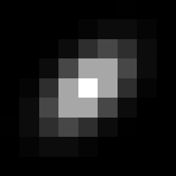
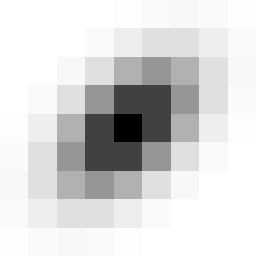
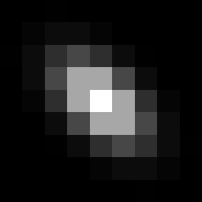
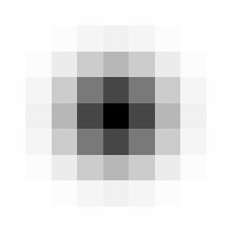

# SynthPix: A lightspeed PIV images generator 🌊

[](https://github.com/IDSCETHZurich/synthpix/stargazers)
[](https://creativecommons.org/licenses/by-sa/4.0/)
[](https://codecov.io/gh/IDSCETHZurich/synthpix)
[](https://github.com/IDSCETHZurich/synthpix/actions/workflows/test.yaml)
[](https://pypi.org/project/synthpix)

[](https://twitter.com/antonio_terpin)

`SynthPix` is a synthetic image generator for Particle Image Velocimetry (PIV) with a focus on performance and parallelism on accelerators, implemented in [JAX](https://docs.jax.dev/en/latest/quickstart.html). `SynthPix` supports the same configuration parameters as existing tools but achieves a throughput several orders of magnitude higher in image-pair generation per second, enabling comprehensive validation and comparison of PIV algorithms, rapid experimental design iterations, and the development of data-hungry methods.


In a nutshell, if you need many synthetic PIV images and you do not want to wait ages, you are better off with `SynthPix` 😄. Below are the performances (image pairs per second) with and without GPU for different batch sizes B.


`SynthPix` is also fairly easy to use:
```python
import synthpix

sampler = synthpix.make(config_path)
for i, batch in enumerate(sampler):
   """batch contains images1, images2, flow_fields, params"""
sampler.shutdown()
```
See `src/main.py` for a fully working example, and check out the [paper]() for more information and performance analysis 🔥.

## Getting started 🚀
Alright, now that hopefully we convinced you to try SynthPix, let's get to it. Don't worry, installing it is even easier than using it:
```bash
pip install synthpix
```
If you have CUDA GPUs,
```bash
pip install "synthpix[cuda12]"
```
If you have issues with CUDA drivers, please follow the official instructions for [cuda12](https://developer.nvidia.com/cuda-downloads?target_os=Linux&target_arch=x86_64&Distribution=Ubuntu&target_version=22.04&target_type=deb_local) and [cudnn](https://developer.nvidia.com/cudnn-downloads?target_os=Linux&target_arch=x86_64&Distribution=Ubuntu&target_version=22.04&target_type=deb_local)
(*Note: wheels only available on linux*).

Check out our [instructions](docs/installing.md) for installing `SynthPix` with Docker and from source.

To generate the images, you need flow data. We provide two scripts to download the commonly used PIV datasets:
```bash
sh scripts/download_piv_1.sh <output_folder> <configs_directory>
```
```sh
sh scripts/download_piv_2.sh <output_folder> <configs_directory>
```
These scripts will automatically save also one configuration file each in `<configs_directory>`. You can use these paths as in the example above.

For more examples and tutorials to use custom flow data or real-world data, check out our [tutorials page](docs/tutorials.md).

## Configuring the synthetic images ⚙️

The configuration is made by the use of a YAML config file.
Your YAML config file is organized into four main groups. Here’s a quick guide to what each set of parameters does:

### 1. Dataset Parameters
By these parameters one can personalize how the extraction of the flow fields works and the shape of the output batch

| **Parameter**            | **Description**                         |
| ------------------------ | --------------------------------------- |
| `seed`                   | Random seed for reproducibility         |
| `batch_size`             | Number of image pairs generated at once |
| `flow_fields_per_batch`  | Number of unique flow fields per batch  |
| `batches_per_flow_batch` | Batches to generate per flow batch      |

### 2. Image Generation Parameters
Define the look and realism of your synthetic PIV images.

| **Parameter**                 | **Description**                                             |
| ----------------------------- | ----------------------------------------------------------- |
| `image_shape`                 | Output image size `[height, width]` (pixels)                |
| `dt`                          | Time between frames (seconds)                               |
| `seeding_density_range`       | Range of particle densities (particles per pixel)           |
| `diameter_ranges`             | List of possible ranges for particle sizes (in pixels).     |
| `diameter_var`                | Variability in particle size                                |
| `intensity_ranges`            | List of possible intensity (brightness) ranges.             |
| `intensity_var`               | Variability in intensity                                    |
| `p_hide_img1` / `p_hide_img2` | Per-particle probability of being hidden in image 1 (or 2). |
| `rho_ranges`                  | List of possible correlation coefficients ranges            |
| `rho_var`                     | Variability in correlation                                  |
| `noise_level`                 | Amplitude of image noise (simulates camera noise)           |

For diameter_ranges, intensity_ranges, and rho_ranges, each parameter is a list of possible ranges. For every image, one range is randomly selected from the list, and then the particle values are sampled from this selected range.

Each *_var parameter controls how much the property of each particle can change between the first and second image of a pair:

diameter_var:
Simulates changes in particle size between frames, making the effect of focus, depth movement, or slight deformations more realistic.

<sub>Increasing the particle diameter makes particles appear larger and more diffuse.</sub>

<p align="center">  <span style="font-size: 2em; vertical-align: middle;">&#8594;</span>  <span style="font-size: 2em; vertical-align: middle;">&#8594;</span>  </p> <sub>Low &nbsp;&nbsp;→&nbsp;&nbsp; Medium &nbsp;&nbsp;→&nbsp;&nbsp; High diameter</sub>

intensity_var:
Models natural brightness changes due to variations in illumination, camera response, or particles moving in and out of the light sheet mimicking out-of-plane motion.

<sub>Raising the intensity parameter produces brighter particles (higher signal-to-noise).</sub>

<p align="center">  <span style="font-size: 2em; vertical-align: middle;">&#8594;</span>  <span style="font-size: 2em; vertical-align: middle;">&#8594;</span>  </p> <sub>Low &nbsp;&nbsp;→&nbsp;&nbsp; Medium &nbsp;&nbsp;→&nbsp;&nbsp; High intensity</sub>

rho_var:
Adds variability to the shape and orientation (elongation/rotation) of particles between frames.

<sub>Increasing rho makes particle spots more elliptical and/or rotated, changing their shape from circular to stretched.</sub>

<p align="center">  <span style="font-size: 2em; vertical-align: middle;">&#8594;</span>  <span style="font-size: 2em; vertical-align: middle;">&#8594;</span>  </p> <sub>Positive &nbsp;&nbsp;→&nbsp;&nbsp; Zero &nbsp;&nbsp;→&nbsp;&nbsp; Negative correlation (`rho`)</sub>


### 3. Flow Generation Parameters
| **Parameter**          | **Description**                          |
| ---------------------- | ---------------------------------------- |
| `velocities_per_pixel` | Spatial resolution of the velocity field |
| `resolution`           | Pixels per unit of physical length       |


### 4. Flow Field Parameters
Describe which region of your flow field is captured, and its velocity bounds.

| **Parameter**                    | **Description**                                         |
| -------------------------------- | ------------------------------------------------------- |
| `flow_field_size`                | Physical area imaged (units must match your flow files) |
| `img_offset`                     | Offset for camera’s position within the flow field      |
| `min_speed_x/y`, `max_speed_x/y` | Range of allowed velocities in each direction           |
| `output_units`                   | Units of the output flow field ("pixels" or physical)   |
| `scheduler_files`                | List of ground-truth flow field files (e.g. `.h5`)      |
| `scheduler_class`                | Loader class for your flow files (usually by extension) |

Minimum and maximum speeds for each axis are not absolute values; they define the full range (positive and negative) of possible velocities along that axis.

## Contributing 🤗
Contributions are more than welcome! 🙏 Please check out our [how to contribute page](docs/contributing.md), and feel free to open an issue for problems and feature requests⚠️.

## Citation 📈
If you use this code in your research, please cite our paper:
```bash
   @article{terpin2025synthpix,
      title={SynthPix: A lightspeed PIV images generator},
      author={Terpin, Antonio and Bonomi, Alan and Banelli, Francesco and D'Andrea, Raffaello},
      year={2025}
   }
```
