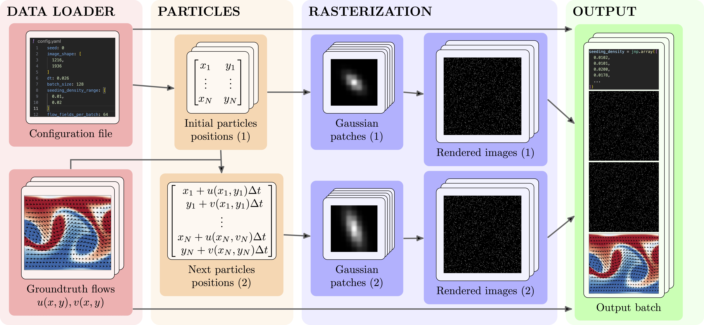
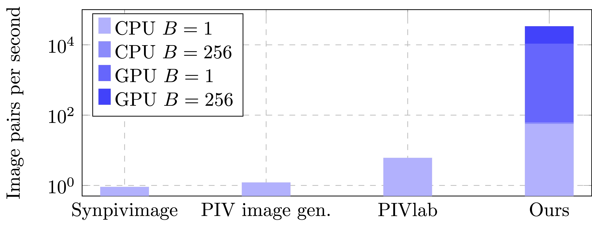

# SynthPix: A lightspeed PIV images generator 🌊

<!-- Test coverage (via Codecov for pytest-cov) -->
[](https://github.com/astral-sh/uv)
[](https://creativecommons.org/licenses/by-sa/4.0/)
[](https://codecov.io/gh/antonioterpin/synthpix)
[](https://github.com/antonioterpin/synthpix/actions)
[](https://pypi.org/project/synthpix)

[](https://twitter.com/antonio_terpin)

`SynthPix` is a synthetic image generator for Particle Image Velocimetry (PIV) with a focus on performance and parallelism on accelerators, implemented in [JAX](https://docs.jax.dev/en/latest/quickstart.html). `SynthPix` supports the same configuration parameters as existing tools but achieves a throughput several orders of magnitude higher in image-pair generation per second, enabling comprehensive validation and comparison of PIV algorithms, rapid experimental design iterations, and the development of data-hungry methods.


In a nutshell, if you need many synthetic PIV images and you do not want to wait ages, you are better off with `SynthPix` 😄. Below are the performances (image pairs per second) with and without GPU for different batch sizes B.


`SynthPix` is also fairly easy to use:
```python
import synthpix

sampler = synthpix.make(config_path)
for i, batch in enumerate(sampler):
   """batch contains images1, images2, flow_fields, params"""
sampler.shutdown()
```
See `src/main.py` for a fully working example, and check out the [paper]() for more information and performance analysis 🔥.

## Getting started 🚀
Alright, now that hopefully we convinced you to try SynthPix, let's get to it. Don't worry, installing it is even easier than using it:
```bash
pip install synthpix
```
If you have CUDA GPUs,
```bash
pip install "synthpix[cuda12]"
```
If you have issues with CUDA drivers, please follow the official instructions for [cuda12](https://developer.nvidia.com/cuda-downloads?target_os=Linux&target_arch=x86_64&Distribution=Ubuntu&target_version=22.04&target_type=deb_local) and [cudnn](https://developer.nvidia.com/cudnn-downloads?target_os=Linux&target_arch=x86_64&Distribution=Ubuntu&target_version=22.04&target_type=deb_local)
(*Note: wheels only available on linux*).

Check out our [instructions](docs/installing.md) for installing `SynthPix` with Docker and from source.

To generate the images, you need flow data. We provide two scripts to download the commonly used PIV datasets:
```bash
sh scripts/download_piv_1.sh <output_folder> <configs_directory>
```
```sh
sh scripts/download_piv_2.sh <output_folder> <configs_directory>
```
These scripts will automatically save also one configuration file each in `<configs_directory>`. You can use these paths as in the example above.

For more examples and tutorials to use custom flow data or real-world data, check out our [tutorials page](docs/tutorials.md).

## Configuring the synthetic images ⚙️

TODO explain

## Contributing 🤗
Contributions are more than welcome! 🙏 Please check out our [how to contribute page](docs/contributing.md), and feel free to open an issue for problems and feature requests⚠️.

## Citation 📈
If you use this code in your research, please cite our paper:
```bash
   @article{terpin2025synthpix,
      title={SynthPix: A lightspeed PIV images generator},
      author={Terpin, Antonio and Bonomi, Alan and Banelli, Francesco and D'Andrea, Raffaello},
      year={2025}
   }
```
